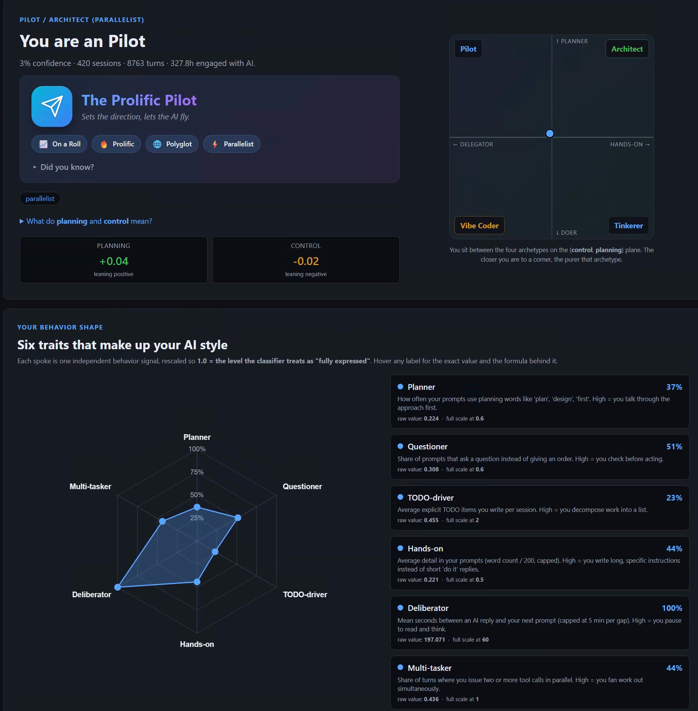
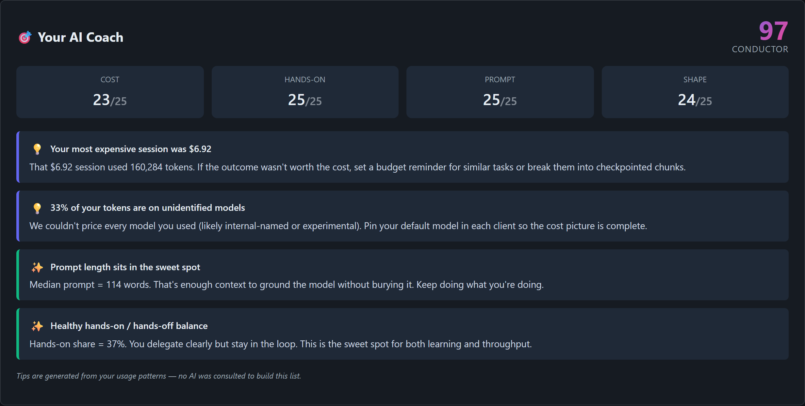
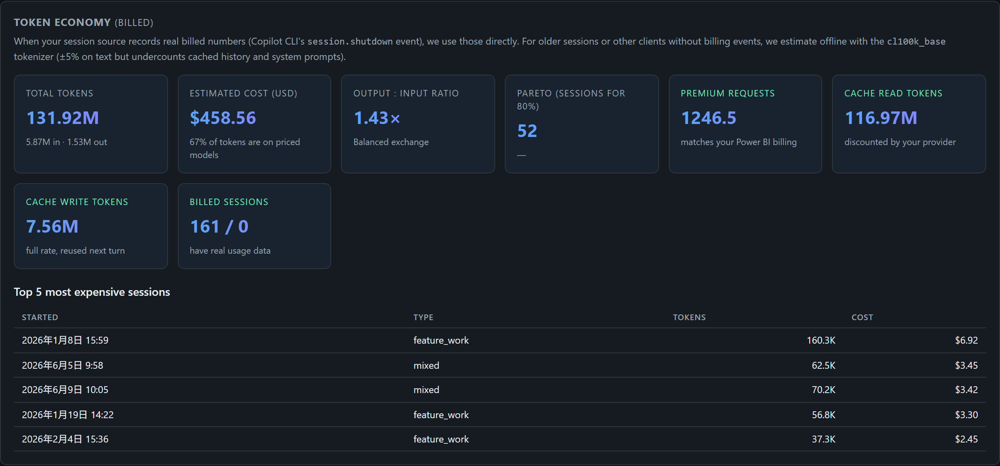
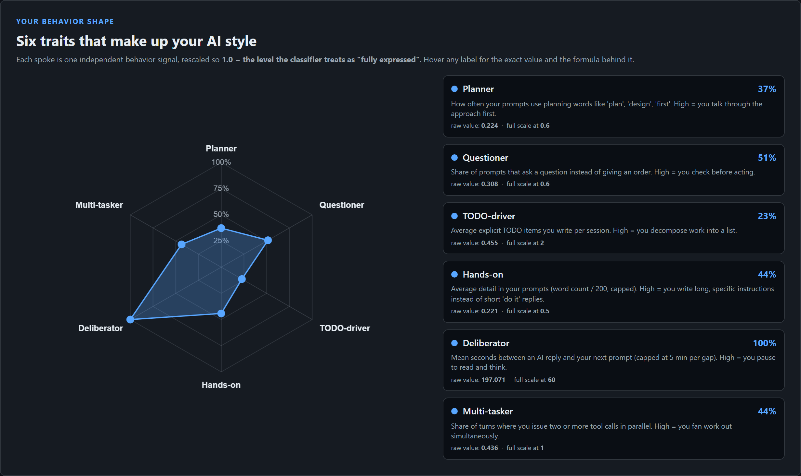
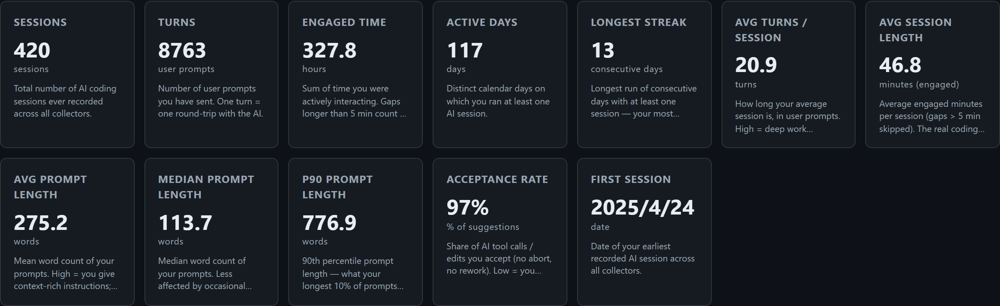

# AICodeStyle

> **Know how you actually use AI.**
> AICodeStyle scans your local sessions from GitHub Copilot CLI, VS Code Copilot Chat, Claude Code, and more — and turns months of conversation history into a single, vivid report: your archetype, your habits, your token economy, and personalised tips to get more out of every AI dollar.

Everything runs on your machine. No accounts. No telemetry. No data ever leaves your laptop.

---

## See it in action



<details>
<summary><b>More screenshots</b> (AI Coach, Token Economy, Behavior Radar, KPIs)</summary>

### Your AI Coach — concrete, prompt-mined tips


### Token Economy — real billed numbers from `session.shutdown`


### Behavior Shape — six independent traits, each with the raw value and formula


### KPI grid — every headline number on one screen


</details>

---

## Table of Contents

- [Why](#why)
- [See it in action](#see-it-in-action)
- [What you get](#what-you-get)
- [Supported AI tools](#supported-ai-tools)
- [Quick start (Windows, no Python required)](#quick-start-windows-no-python-required)
- [Quick start (developers)](#quick-start-developers)
- [The portal at a glance](#the-portal-at-a-glance)
- [Privacy](#privacy)
- [Architecture](#architecture)
- [Building your own shareable bundle](#building-your-own-shareable-bundle)
- [Tuning the classifier](#tuning-the-classifier)
- [Roadmap](#roadmap)
- [FAQ](#faq)
- [License](#license)

---

## Why

You use four different AI coding assistants every week. Each one keeps a conversation log on disk somewhere. None of them tell you:

- How many sessions you really run, when, and for how long.
- Which questions you actually type vs. which work the AI takes from you.
- Whether your prompts are getting better or just longer.
- Where your monthly AI token budget actually goes.
- Whether you behave more like an **architect** designing with an agent, or a **vibe-coder** trusting the model to figure it out.

AICodeStyle answers all of those — in one local-first dashboard you can open offline.

---

## What you get

After one click ("Scan sessions"), the portal generates a single-page report. Top to bottom:

### 1. AI Personality

A nickname + tagline + 3–6 *Did you know?* facts mined directly from your prompts. Examples:

> 🦅 **The Prolific Pilot** &nbsp;·&nbsp; *Plans first, then lets the AI fly*
> - 🌙 Your latest session ended at **02:47 AM** on a Tuesday.
> - ✍️ Your longest single prompt was **1,284 words** — more text than this README's intro.
> - 🏃 11 sessions in a single day on Mar 14 (your personal record).
> - 🔁 You ran the same multi-line refactor request three times in 20 minutes.

### 2. AI Coach 🎯

A grade card (A / B / C / D) across five axes — **Cost efficiency · Hands-on balance · Prompt quality · Session shape · Model mix** — plus 2–6 prioritised, severity-tagged tips written from rules that fire only when your data triggers them. Examples:

- *"You spent 38% of your premium-request budget on prompts <30 words — try GPT-4o mini for these."*
- *"73% of your sessions exceed 2 hours — try splitting after the first checkpoint."*
- *"You almost never paste file paths into prompts — your acceptance rate drops 22% in those sessions."*

### 3. AI Profile narrative (auto-generated)

If a local `copilot` CLI is on your PATH, AICodeStyle asks it to write a 4-section Markdown profile (Who you are · How you work · Strengths · Suggestions) using your aggregated signals. **The narrative regenerates automatically after every scan.** If no copilot binary is installed, the section explains exactly that — no fake placeholder text.

### 4. KPI cards (12 of them)

Total sessions, total turns, total hours, active days, longest streak, avg / median / p90 turns per session, avg / median / p90 prompt words, acceptance rate, first session date.

### 5. Charts (Chart.js, vendored locally — no CDN)

- **Session-purpose doughnut** — every session is classified into one of 10 purposes (feature work, debugging, testing, refactoring, code review, learning, documentation, configuration, planning, casual chat).
- **Top tools** bar — most-invoked tool names across all sessions.
- **90-day activity** line — sessions per day over the trailing quarter.
- **Hour-of-day** bar — when you actually code with AI.
- **Weekday** bar — Monday warrior or weekend ninja?

### 6. GitHub-style activity heatmap

A 12-month calendar grid showing session intensity per day. Hover any cell for the exact count.

### 7. Archetype quadrant

A 2-axis Planning × Control map placing you in one of four primary archetypes:

|              | High Control                    | Low Control                    |
| ------------ | ------------------------------- | ------------------------------ |
| **High Planning** | 🏛️ **Architect** — designs first, drives tools | 🛩️ **Pilot** — plans, then lets the AI fly |
| **Low Planning**  | 🔧 **Tinkerer** — hands-on, exploratory       | 🌊 **Vibe Coder** — "just build it, ship it" |

A 6-spoke radar (Planner · Questioner · TODO-driver · Hands-on · Deliberator · Multi-tasker) adds nuance, and modifier tags (`debugger`, `parallelist`, `yolo`, …) appear when triggered.

### 8. Achievement badges

Things like 🏆 **Streak master** (14-day run), 🌙 **Night owl** (≥30 % of activity after 10 PM), 💬 **Conversationalist** (≥50 turns/session avg), 📚 **Polyglot** (≥4 file extensions), ⚡ **Speed runner** (median session <8 minutes), ✨ **Specialist**, 🎓 **Veteran**…

### 9. Token economy

Total billed tokens, prompt vs. completion split, premium-request count, estimated cost in USD, breakdown per model, and a "cost per accepted suggestion" derived metric. Cost rules in `pricing.py` are tunable.

### 10. Top-N tables

Most-used projects, models, file extensions, with counts and percentages.

### 11. Data Sources

A transparency panel showing every scanner that ran, what it found, and where it looked — so when the report says "237 VS Code sessions" you can verify it across both the legacy per-workspace JSON store and the new SQLite session store.

### 12. Download as HTML report

One-click export. Self-contained HTML you can email yourself, archive, or compare month-over-month.

---

## Supported AI tools

| AI tool | Status | Where it reads from |
| --- | --- | --- |
| **GitHub Copilot CLI** | ✅ Supported | `~/.copilot/session-state/*.db` (SQLite) and legacy JSON snapshots |
| **VS Code — GitHub Copilot Chat** | ✅ Supported | `%APPDATA%\Code\User\workspaceStorage\**\chatSessions\*.json` *and* `%APPDATA%\Code\User\globalStorage\github.copilot-chat\session-store.db` (also Code-Insiders, macOS, Linux) |
| **Claude Code** | ⏳ Planned | `~/.claude/projects/**/*.jsonl` |
| **OpenAI Codex CLI** | ⏳ Planned | `~/.codex/sessions/` |
| Visual Studio IDE Copilot | ❌ Not feasible | VS does not persist Copilot Chat to disk in a parseable form. |

The portal triggers a scan when you click **Scan sessions**. If nothing is found, it tells you exactly which paths it looked at and which tools are supported — no silent zero.

---

## Quick start (Windows, no Python required)

The fastest way to try AICodeStyle.

1. Grab the latest **`AICodeStyle.zip`** from the [Releases](#) page.
2. Right-click → **Extract All…** to anywhere you can write (Desktop, OneDrive, USB stick — but **not** under a sandboxed `Downloads`).
3. Open the new `AICodeStyle\` folder and double-click `AICodeStyle.exe`.
4. A console window opens, prints `AICodeStyle portal: http://127.0.0.1:8765/`, and your browser pops to the portal automatically.
5. Click **Scan sessions** (first scan may take 10–30 s). The personality, coach, and full report render the moment the scan finishes.

To stop: close the console window. To update: delete the old folder and unzip the new one — your cache at `%LOCALAPPDATA%\AICodeStyle\` survives.

### Things to know up front

- **Windows SmartScreen** may show "Windows protected your PC" the first time (unsigned binary). Click **More info → Run anyway**. This is expected for any internally-built exe.
- **Some antivirus** suites flag PyInstaller bundles. The binary is safe; the false positive comes from the PyInstaller bootloader. Whitelist the folder.
- **Corporate Application Control (WDAC / AppLocker)** can still block execution on locked-down machines. See [SHARING.md](SHARING.md) for fallback options (code-signing, Microsoft Store Python, WSL).

---

## Quick start (developers)

Requires Python 3.11+.

```bash
git clone <repo-url> AICodeStyle
cd AICodeStyle
python -m venv .venv

# Windows
.\.venv\Scripts\Activate.ps1
# macOS / Linux
source .venv/bin/activate

pip install -e ".[dev]"
```

Then:

```bash
# Terminal report
AICodeStyle scan        # ingest sessions into the local DuckDB cache
AICodeStyle report      # print archetype + KPIs to the terminal

# Web portal (recommended)
AICodeStyle serve       # opens http://127.0.0.1:8765 automatically
```

Portal flags: `--host 0.0.0.0` (LAN), `--port 9000`, `--no-open-browser` (headless / SSH).

Run tests:

```bash
python -m pytest        # 238 tests, all should pass
```

---

## The portal at a glance

Sections render in this order so the most personal, vivid material comes first and the supporting evidence comes after:

```
┌──────────────────────────────────────────────┐
│ 🦅 The Prolific Pilot · "Plans, then lets…"  │  ← Personality
│ Did you know? · 3–6 vivid facts              │
├──────────────────────────────────────────────┤
│ AI Coach 🎯  · Grade A · 4 prioritised tips  │  ← Coach
├──────────────────────────────────────────────┤
│ AI Profile (auto)  · 4-section narrative     │  ← Markdown narrative
├──────────────────────────────────────────────┤
│ 12 KPI cards                                 │
│ 5 charts                                     │
│ 12-month heatmap                             │
│ Archetype quadrant + radar                   │
│ Achievement badges                           │
│ Token economy                                │
│ Top projects / models / extensions           │
│ Data sources transparency panel              │
└──────────────────────────────────────────────┘
```

A **Download HTML report** button at the top exports the whole page as a self-contained file.

---

## Privacy

- **100% local.** No telemetry, no analytics pings, no calls home.
- **Read-only.** AICodeStyle never modifies a single session file. SQLite stores are opened with `file:?mode=ro` URIs so they coexist safely with a running VS Code or Copilot CLI.
- **Local cache only.** Features and aggregates live in `%LOCALAPPDATA%\AICodeStyle\` (Windows) / `~/.local/share/AICodeStyle/` (Linux) / `~/Library/Application Support/AICodeStyle/` (macOS). Safe to delete; rebuilds on next scan.
- **Portal binds to `127.0.0.1`** by default. Use `--host 0.0.0.0` only if you knowingly want it on the LAN.
- **PII redaction** runs at normalization time on prompts and assistant output: GitHub PATs, Bearer tokens, AWS keys, `password=` strings, and email addresses are scrubbed before features are computed.
- **The optional AI Profile narrative** invokes your local `copilot` (or other CLI you configure) subprocess — that subprocess obeys whatever auth + network policy your existing install already uses. Nothing else makes a network call.

---

## Architecture

```
src/AICodeStyle/
├── cli.py            # typer entry point: scan / report / serve
├── discovery.py      # find session files across Copilot CLI + VS Code (JSON + SQLite)
├── collectors/       # one parser per source format → NormalizedSession
│   ├── copilot_cli.py
│   └── vscode_copilot.py
├── normalize.py      # NormalizedSession / Turn / ToolCall pydantic models
├── redact.py         # PII scrubbing (PATs, AWS keys, emails, …)
├── features.py       # per-session signal extractors + UserProfile aggregator
├── stats.py          # mean / median / p90 / streak helpers
├── classifier/
│   ├── rules.py      # axis math + tag activation
│   └── weights.yaml  # tunable weights — see "Tuning"
├── insights.py       # personality nickname, badges, did-you-know facts
├── coaching.py       # 15+ rule-based coach tips + 5-axis grade card
├── pricing.py        # token-economy cost rules
├── narrative.py      # AI Profile Markdown generator (calls local copilot CLI)
├── store.py          # DuckDB cache (FeatureStore, SCHEMA_VERSION 13)
└── web/
    ├── app.py        # FastAPI app
    ├── services.py   # scan orchestration + /api/profile aggregator
    └── static/       # vanilla JS portal + Chart.js (no CDN)

tests/                # 238 pytest tests
packaging/build_exe.ps1   # one-folder PyInstaller bundle → dist/AICodeStyle.zip
```

Cache schema is versioned (`SCHEMA_VERSION`); bumping it on a release forces a clean rebuild for upgraded users.

---

## Building your own shareable bundle

On a Windows box with Python 3.11+:

```powershell
.\packaging\build_exe.ps1
```

Outputs:

- `dist\AICodeStyle\` — one-folder bundle (~120 MB, runs in place; no `%TEMP%` extraction so it works under most WDAC / AppLocker policies)
- `dist\AICodeStyle.zip` — shareable archive (~52 MB)

Ship the `.zip`. End-users unzip and double-click. See [SHARING.md](SHARING.md) for the full distribution playbook, including code-signing and WSL fallbacks.

---

## Tuning the classifier

The Planning × Control axes are computed from weighted signals in `src/AICodeStyle/classifier/weights.yaml`. Bump a weight, restart the portal, click "Scan sessions" — your archetype recomputes immediately. Same goes for the coach (rules in `coaching.py`) and pricing rules (`pricing.py`).

The defaults reflect a generalist developer profile. For specialised teams (e.g., research, ops, security), forking the weights is encouraged.

---

## Roadmap

Shipped:

- ✅ Copilot CLI + VS Code Copilot Chat ingestion (legacy JSON + new SQLite session store)
- ✅ Personality, badges, Did-You-Know facts
- ✅ AI Coach grade card + prioritised tips
- ✅ Token economy + premium-request accounting
- ✅ Auto-generated AI Profile narrative
- ✅ HTML report download
- ✅ Windows one-click `.exe` bundle

Up next:

- ⏳ Claude Code session ingestion
- ⏳ OpenAI Codex CLI session ingestion
- ⏳ Month-over-month diff view ("you improved on prompt quality this month")
- ⏳ Per-project drill-down
- ⏳ macOS / Linux pre-built bundles

---

## FAQ

**Q: Where is data stored?**
`%LOCALAPPDATA%\AICodeStyle\` (Windows). Safe to delete; AICodeStyle rebuilds on next launch.

**Q: How big is the download?**
~52 MB zipped, ~120 MB unzipped.

**Q: Does it need internet?**
No, unless the AI Profile narrative step is enabled — that calls your local `copilot` binary, which has its own auth + network policy.

**Q: Can I run it on macOS / Linux?**
The Python package works on both (`pip install -e .` and `AICodeStyle serve`). The pre-built `.exe` is Windows-only — build a native bundle on each platform with the same PyInstaller spec.

**Q: My report shows 0 VS Code sessions but I use Copilot Chat all the time. What gives?**
VS Code Copilot Chat now stores sessions in either per-workspace JSON files *or* a single SQLite session store (post-Chat-rewrite). AICodeStyle reads both. If you still see 0, check the **Data Sources** panel at the bottom of the report — it shows exactly which paths were scanned. File an issue with that output.

**Q: Will the report judge me?**
No. Every archetype is a legitimate style. The coach tips are framed as opportunities, not failures — there's no "right" way to use AI.

---

## License

MIT — see [LICENSE](LICENSE).

---

*Built with Python 3.12, FastAPI, DuckDB, Pydantic, Chart.js, and a lot of self-reflection.*
